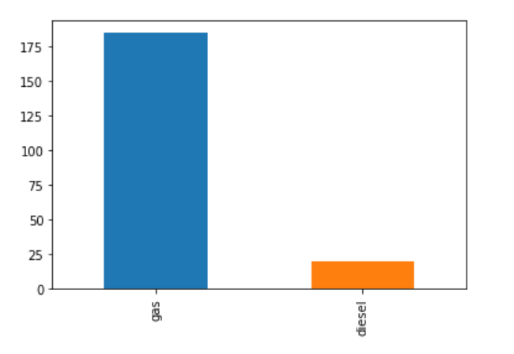
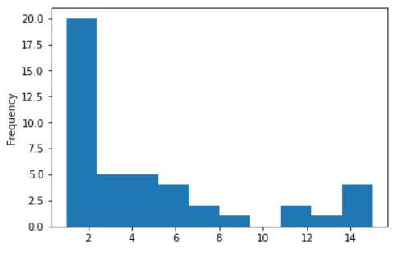
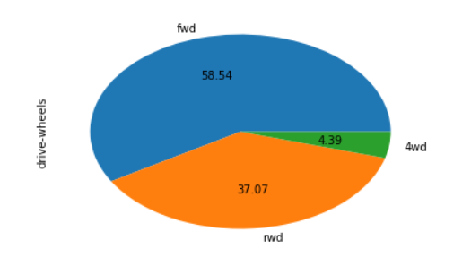
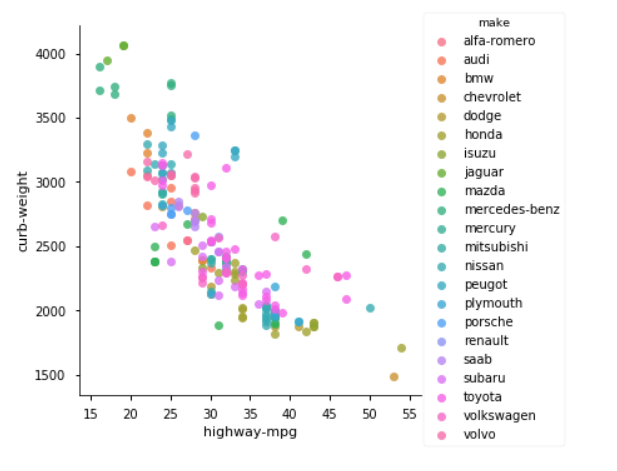
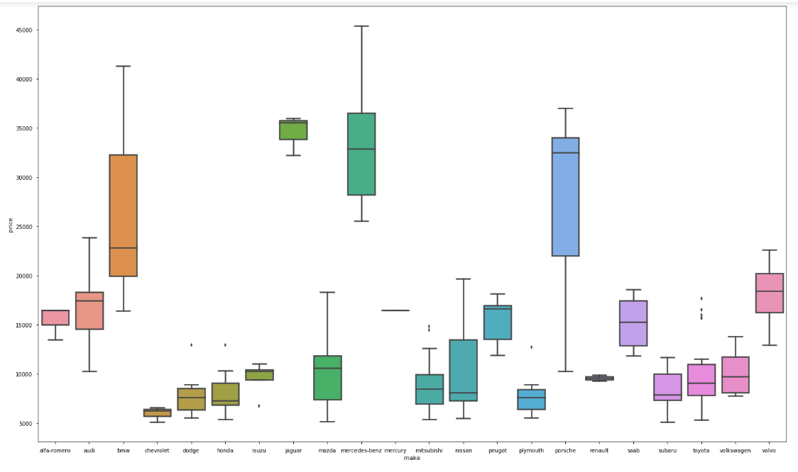

# EDA-on-Automobile-Dataset
Performed EDA on a Automobile Dataset after cleaning it using Pandas and Numpy for Data Manipulation followed by Matplotlib and Seaborn for Data Visualisation.

Some insights:

